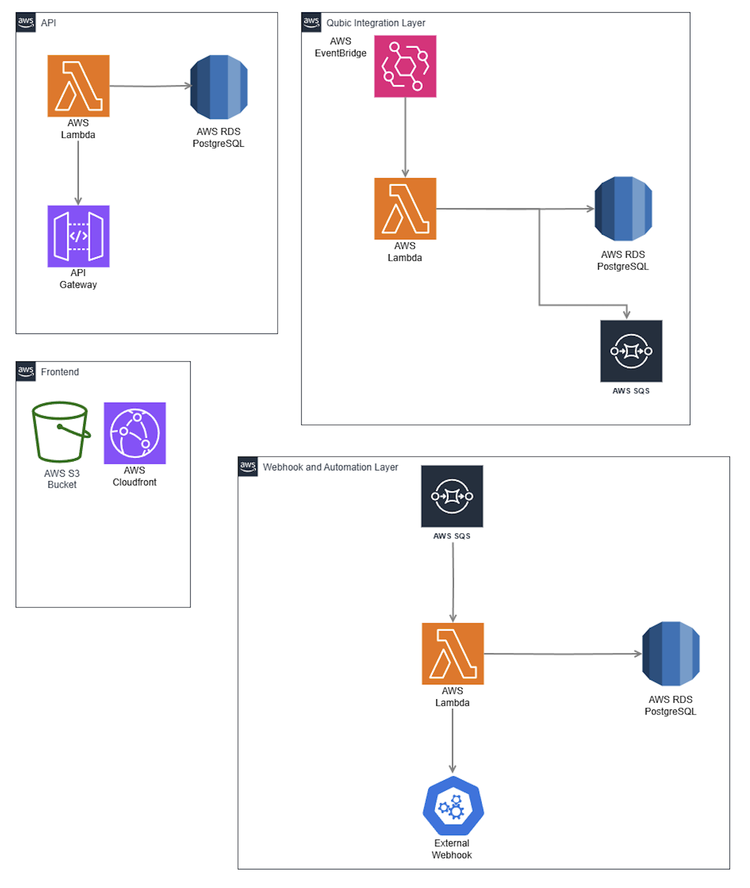

# Easy Connect - Make Qubic for everyone

## 1. Project overview

Easy Connect is a solution that provides quick and easy access to any Qubic smart contract data, enabling applications and developers to leverage the full potential of this network into their business logic, without the need for them to implement any technical integration with the Qubic network.

In addition to providing quick integration for any application or service, Easy Connect provides a simple way for integrating Qubic into no-code platforms like Make or Zappier, allowing millions of users inmediate access to Qubic without requiring technical knowledge.

## 2. Scope of the proposal

Our proposal for joining the Qubic incubation program is to create an initial version of Easy Connect that will monitor every information related to the main smart contracts already deployed into Qubic, allowing any application or service to subscribe and receive in real time every data generated on the network, via webhooks.

This first Easy Connect version will also offer a web-based configuration panel where users can select the smart contracts they want to monitor and the information they want to receive, as well as the endpoint to which our platform will send the data in real time.

The scope of the proposal includes the creation of a webhook-based Easy Connect integration example with Make, with the necessary documentation to allow any user, without technical knowledge, to integrate existing Qubic information into any application or process. Additionally, we will submit a request to Make to add Easy Connect to the more than 1,600 applications compatible with this leading no-code platform.

## 3. Functionality

### 3.1 Event abstraction from Qubic smart contracts

Easy Connect provides a real-time abstraction layer over the Qubic network, enabling applications and services to subscribe to smart contract activity without requiring low-level blockchain integration.

### 3.2 Programmable alert system

Users can define customized conditions based on smart contract procedures, transaction parameters, sender/receiver addresses, and more. When these conditions are met, Easy Connect triggers alerts and initiates automated responses.

### 3.3 Webhook-based data delivery

Decoded contract data is sent to user-defined endpoints via standard webhooks, allowing instant integration with automation platforms, third-party systems, or internal tools, without the need to maintain infrastructure.

### 3.4 Secure API access
Access to Easy Connect’s services is protected through an API key system, ensuring that only authorized users and systems can interact with the platform, and enabling usage monitoring per account.

### 3.5 Web-based management dashboard

A web interface allows users to manage their alerts, monitor activity, and review historical event data. Through this panel, users can activate or deactivate triggers, inspect past alerts, and configure webhook destinations.

### 3.6 Authenticated user experience

Access to the management dashboard is gated by a simple, secure authentication system, ensuring that each user’s configuration and data remain isolated and protected within their account.

## 4. Tech stack

Easy Connect is architected as a cloud-native, event-driven platform optimized for scalability, maintainability, and real-time data processing. The solution leverages proven technologies to ensure high availability, secure access, and seamless integration with third-party systems.

### 4.1 Backend

The backend is developed in C# and deployed using AWS Lambda, following a serverless architecture to ensure elasticity and cost-efficiency. Event processing is decoupled using Amazon SQS, allowing for asynchronous and fault-tolerant handling of transaction streams, alert evaluation, and webhook dispatching.

### 4.2 Frontend

The user interface is built with Angular, providing a modern, responsive web application where users can authenticate, manage alerts, view their API key, and inspect historical events. The UI is designed to be intuitive for both developers and no-code users.

### 4.3 Database

A PostgreSQL instance serves as the main data store, managing user accounts, alert definitions, system events, and webhook delivery logs. It supports transactional integrity, complex filtering, and analytics over time-based blockchain activity.

### 4.4 Qubic integration layer

Implemented in C#, this component interfaces directly with the Qubic network to monitor activity on selected smart contracts. It decodes binary payloads into structured data models and publishes decoded events into Amazon SQS queues for further processing by downstream services.

### 4.5 Webhook and automation layer

Also developed in C#, the automation layer consumes events from SQS, evaluates alert conditions, and dispatches structured payloads to user-defined endpoints via HTTP webhooks. This makes it easy to integrate Qubic data with automation platforms like Make, Zapier, or enterprise systems.

## 5. Monetization

Our strategy: **Freemium to scale. Premium to grow.**

Easy Connect's business model will be based on two distinct customer segments:

### Qubic ecosystem

The target audience is developers and users of the Qubic ecosystem who want to easily and quickly integrate real time data into their projects.

- **Free tier**: Monitoring of existing information in a single Qubic smart contract, with limited performance and basic support.
- **Premium tier**: Full access to the main Qubic smart contracts, parameterization through a user dashboard, receipt of real-time information and having premium support.

### No-code platforms

Easy Connect Qubic modules for the main no-code platforms (Make, Zappier, etc.), offering two modalities:
- **Free tier**: Basic functionality, to use Easy Connect integration via webhook.
- **Premium tier 🕐**: Extended usage, advanced features, and premium support.

### Early adoption incentives 

During the final phase of the project, we will launch campaigns aimed at attracting early users, incentivizing them through discounts and promotions, to scale faster after the launch and obtain promoters that will allow us to attract more users.
 
- **Discounts**: Reduced pricing for early users.  
- **Testimonial rewards**: Benefits for users sharing case studies.  
- **Roadmap influence**: Premium early users can vote on feature prioritization.

## 6. Marketing and communication strategy

### Value proposition  

Position **Easy Connect as "the bridge between two worlds"**, the intricate blockchain ecosystem and the user-friendly automation tools businesses already rely on.

Core messaging will emphasize:  
- **Democratization**: "Qubic for everyone, no coding required."  
- **Simplicity**: "Transform weeks of development into minutes of configuration."  
- **Trust**: "Deliver trustworthy Qubic data to business processes." 

### Audience targeting

We will focus on three different buyer persona:
- **Qubic ecosystem**: Existing applications and services who want to obtain data in real time for monitoring, reporting, user support...
- **No-code/low-code developers**: Current users of Make/Zapier looking to expand their automation capabilities including Qubic data.  
- **Web3 startups and blockchain firms**: Requiring seamless integration with Qubic network.  

### Social media strategy  

Since we won second prize at [MAD Hack 2025](https://qubic.org/blog-detail/qubic-vottun-2025-madrid-hackathon-recap) we have started a social media positioning strategy, which will be increased during the development of the project to achieve community engagement and capture potential leads, as well as Easy Connect promoters.

We will focus on X and Farcaster, where the communities interested in Blockchain and Web3 are currently located, to capture potential leads and generate engagement.

In parallel, we will use LinkedIn to reach companies and professionals interested in automation and the Blockchain applications they can integrate into their businesses.

We will continue to actively participate in the Qubic ecosystem (in English and Spanish) on both Telegram and Discord, to achieve community engagement and capture potential leads, as well as promoters.

If we have the budget available, we will define additional actions to promote Easy Connect.

### Implementation timeline 

The marketing and communications strategy will be developed in parallel with the execution of the Easy Connect project plan and will continue beyond the scope indicated in this proposal. 

## 7. Project plan and deliverables

Project planning is structured into the following phases, each of which specifies the activities and deliverables to be generated:

- **Project start - MAD Hack 2025:** March 24 2025

- **Milestone 1 - Proposal aproval:** April 15 2025

- **Milestone 2 - Technical design:** May 15 2025
  - Architecture definition.
  - Functional definition.
  - Design definition (Figma wireframes).
  - Marketing and communication plan.

- **Milestone 3 - Testnet integration:** June 30 2025
  - Qubic integration with one smart contract (test environment).
  - Webhook integration beta.
  - Initial integration tests.
  - Landing page beta.
  - Management dashboard beta.
  - Community building.

- **Milestone 4 - Mainnet integration:** July 31 2025
  - Qubic integration with most relevant mainnet smart contracts.
  - Webhook integration v1.0.
  - Landing page v1.0.
  - Management dashboard v1.0.
  - Integration tests.
  - Initial marketing campaigns (soft launch).
  
- **Milestone 5 - Make integration (webhook):** August 31 2025
  - Qubic Easy Connect example for Make.
  - Submission of custom module to Make.
  - Usability test.
  - Technical documentation.
  - User documentation.
  - Proposed roadmap.

This planning and scope is subject to the technical availability of the mainnet and testnet networks, technical documentation, and development tools provided by Qubic, as well as the support required for the development of the various components of the solution. Submission to Make does not imply acceptation.

## 8. Budget and payment plan

### Budget breakdown

The budget required for the development of the Easy Connect solution, according to the described scope, amounts to 25,000 EUR, broken down into the following items:
- **Technical Development:** 15,000 EUR
- **UX/UI Design:** 5,000 EUR
- **Product and Business development:** 3,500 EUR
- **Marketing and Communications:** 1,500 EUR

### Payment plan:

Payments will be made according to the following schedule, based on the achievement of the specified milestones:
- **Milestone 1 - Proposal aproval:** 20% budget (5,000 EUR)
- **Milestone 2 - Technical design:** 15% budget (3,750 EUR)
- **Milestone 3 - Testnet integration:** 25% budget (6,250 EUR)
- **Milestone 4 - Mainnet integration:** 25% budget (6.250 EUR)
- **Milestone 5 - Make integration (webhook):** 15% budget (3,750 EUR)

### Additional costs:

Besides the budget needed to develop the Easy Connect solution described in this document, there are additional costs to maintain it after this project is completed and all milestones are achieved:
- **Hosting:** 5,000 EUR/year
- **Software, licences and subscriptions:** 5,000 EUR/year
- **Operation and Maintenance:** 7,200 EUR/year (e-mail 8x5 support and 24x7 monitoring)
- **Marketing:** 12,000 EUR/year
- **Community management:** 7,200 EUR/year
- Audit costs are not included.
- Legal costs are not included.

These additional costs are estimated. If the actual costs are lower than anticipated, the surplus funds will be reimbursed.

## 9. Profile and experience

### Team members

- **Jorge Ordovás (Product and Business Development / Marketing and Communications):**
  - Information Technology professional with 25 years of experience in the development of products and services in many different sectors (telecommunications, payments, security, eHealth, energy, cloud, blockchain, web3).
  - Working in Blockchain consulting and development of projects based on blockchain technologies since 2015 when he cofounded [Nevtrace](https://nevtrace.com), the first Blockchain lab in Spain.
  - Senior manager working in Blockchain and Web3 product and business development since 2018 at [Telefonica](https://metaverso.telefonica.com/en/welcome-to-metaverse).
  - **LinkedIn (+10,000 followers):** [Jorge Ordovas](https://www.linkedin.com/in/jorgeordovas/)
  - **X (+6,000 followers):** [@joobid](https://x.com/joobid) and [@nevtrace](https://x.com/nevtrace)
  - **Farcaster (+3,000 followers):** [@joobid.eth](https://warpcast.com/joobid.eth) and [@nevtrace](https://warpcast.com/nevtrace)

- **Rafael Montaño (UX/UI and Product Design)**
  - Co-founder of [Loiband](https://www.loiband.com/home-en), technology consultancy and UX Product Specialist, with experience in UX/UI and product design. He has led the creation of more than 10 scalable digital products.
  - His approach combines user research, prototyping, and design systems in apps, Web2, and Web3, helping startups and companies launch innovative and optimized solutions for the digital market.
  - **LinkedIn:** [Rafael Montaño](https://www.linkedin.com/in/rafael-monta%C3%B1o-marroquin/)
 
- **Jesús Lanzarote (Full Stack Development)**
  - Co-founder and CTO of Loiband. He has been programming for over 25 years and has worked in the startup world for 15 years, where he has participated in all types of projects across multiple areas (eHealth, services, insurance, legal, etc.), leading teams and directly participating in design and development.
  - His current focus is on developing AI-based and Web3 projects.
  - **LinkedIn:** [Jesús Lanzarote](https://www.linkedin.com/in/jesus-lanzarote/)

### External collaborators

- **Pablo F. Burgueño (Advisor)**
  - Cofounder of NevTrace and a lawyer specializing in cybersecurity, privacy, and LegalTech law.
  - He currently works as a lawyer and professor at ESIC, and he is a member of INMERSIVA XR, DENAE, and ASEDA, as well as the data protection and cryptoasset spaces of the European Cybercrime Centre at Europol.
  - **LinkedIn (+13,000 followers):** [Pablo F. Burgueño](https://www.linkedin.com/in/pablofb/)
  - **X (+8,000 followers):** [@pablofb](https://x.com/pablofb)
  - **Farcaster (+2,000 followers):** [@pablofb](https://warpcast.com/pablofb)

Moreover, with more than a decade of experience in the startup and corporate ecosystem, we have a broad network of contacts, freelance professionals specialized in blockchain technology, frontend, backend, infrastructure, and more. We will involve them in the project as external collaborators if additional resources are needed to meet the defined milestones.
  
### Public projects developed by team members

* [Foodcoin](https://www.foodcoin.global)
* [Referity](https://referity.es)
* [Residelia](https://residelia.com)
* [Mscope](https://www.mscope.tech)
* [Heris](https://heris.loiband.com)
* [Normafin](https://normafin.com)
* [TU Wallet](https://www.telefonica.com/en/transformation-handbooks/innovation-handbook/tu-wallet-a-multi-crypto-digital-wallet/)
* [TrustOS](https://www.eleconomista.es/especial-tecnologia-startups/noticias/10261692/12/19/Telefonica-lanza-TrustOS-para-facilitar-operaciones-blockchain.html)

## 10. Conclusion

At NevTrace we've been working for a decade to **become the link between the real world and the on-chain ecosystem**.

Our mission is to help companies that want to take advantage of the opportunities offered by blockchain **and on-chain projects that need to go beyond early adopters**.

The Easy Connect proposal we're presenting **aligns perfectly with our vision and addresses a real need in the Qubic ecosystem** to drive its growth both within the current ecosystem and beyond, toward the early majority.

**We're confident that the proposal will be interesting for Qubic**, and that we can develop an initial commercial version of Easy Connect thanks to the Qubic Incubation Program.

Furthermore, **we confirm our willingness to maintain and evolve the Easy Connect solution** beyond the scope defined in this proposal, **in case we receive the necessary funding** through Qubic's grant programs or other funding alternatives.
