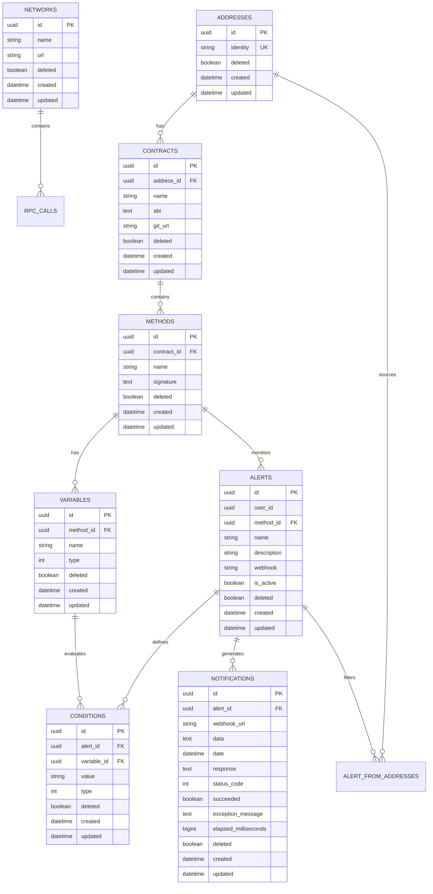

# Easy Connect Backend - Technical Documentation

## Table of Contents

- [1. Architecture Overview](#1-architecture-overview)
- [2. Technology Stack](#2-technology-stack)
- [3. Clean Architecture Implementation](#3-clean-architecture-implementation)
- [4. Database Design](#4-database-design)
- [5. Domain Layer](#5-domain-layer)
- [6. Application Layer](#6-application-layer)
- [7. Infrastructure Layer](#7-infrastructure-layer)
- [8. Presentation Layer](#8-presentation-layer)
- [9. Integration Layer](#9-integration-layer)
- [10. Blockchain Integration & RPC Layer](#10-blockchain-integration--rpc-layer)
- [11. Message Queue System](#11-message-queue-system)
- [12. API Design Patterns](#13-api-design-patterns)
- [13. Data Flow Architecture](#14-data-flow-architecture)

---

## 1. Architecture Overview

Easy Connect follows **Clean Architecture** principles to build a scalable blockchain monitoring platform. The system enables users to create smart contract alerts and receive real-time notifications via webhooks when specific conditions are met.

### Core Architectural Principles

- **Dependency Inversion**: Inner layers define interfaces, outer layers implement them
- **Separation of Concerns**: Each layer has distinct responsibilities
- **SOLID Principles**: Applied throughout the codebase
- **Domain-Driven Design**: Business logic centered in the domain layer

### High-Level Architecture

```
┌─────────────────────────────────────────────────────────────┐
│                 🌐 PRESENTATION LAYER                       │
│  EasyConnect.API (REST API + AWS Lambda)                    │
└─────────────────────────────────────────────────────────────┘
                              │
                              ▼
┌─────────────────────────────────────────────────────────────┐
│                📋 APPLICATION LAYER                         │
│  • EasyConnect.Application (Use Cases)               │
│  • EasyConnect.RPC (Qubic Integration)                 │
└─────────────────────────────────────────────────────────────┘
                              │
                              ▼
┌─────────────────────────────────────────────────────────────┐
│               🗄️ INFRASTRUCTURE LAYER                       │
│  EasyConnect.Infrastructure (EF Core + PostgreSQL)          │
└─────────────────────────────────────────────────────────────┘
                              │
                              ▼
┌─────────────────────────────────────────────────────────────┐
│                💼 DOMAIN LAYER                              │
│  EasyConnect.Domain (Entities + Business Rules)             │
└─────────────────────────────────────────────────────────────┘

┌─────────────────────────────────────────────────────────────┐
│               🔄 INTEGRATION LAYER                          │
│  • EasyConnect.QueueSender (AWS Lambda)                     │
│  • EasyConnect.QueueListener (AWS Lambda)                   │
└─────────────────────────────────────────────────────────────┘
```

---

## 2. Technology Stack

### Backend Technologies

| Component              | Technology            | Version | Purpose                |
| ---------------------- | --------------------- | ------- | ---------------------- |
| **Runtime**            | .NET                  | 8.0     | Core framework         |
| **API Framework**      | ASP.NET Core          | 8.0     | REST API development   |
| **Database**           | PostgreSQL            | Latest  | Primary data store     |
| **ORM**                | Entity Framework Core | 8.0     | Data access layer      |
| **Cloud Platform**     | AWS                   | -       | Infrastructure hosting |
| **Serverless**         | AWS Lambda            | -       | Background processing  |
| **Message Queue**      | AWS SQS               | -       | Asynchronous messaging |
| **Authentication**     | AWS Cognito           | -       | User management        |
| **Object Mapping**     | Mapster               | 7.4.0   | DTO mapping            |
| **API Documentation**  | Swagger/OpenAPI       | 8.1.0   | API documentation      |
| **JSON Serialization** | Newtonsoft.Json       | 13.0.3  | JSON processing        |

### Development Tools

- **IDE**: Visual Studio 2022
- **Version Control**: Git
- **Database Migrations**: EF Core Migrations
- **API Testing**: Swagger UI
- **Deployment**: AWS Lambda Tools

---

## 3. Clean Architecture Implementation

### Project Structure

```
EasyConnect/
├── EasyConnect.Domain/              # 🏛️ Core business entities
├── EasyConnect.Application/         # 📋 Use cases and business logic
├── EasyConnect.Infrastructure/      # 🗄️ Data access and external services
├── EasyConnect.API/                 # 🌐 REST API controllers
├── EasyConnect.RPC/                 # 🔗 Qubic integration
├── EasyConnect.QueueSender/         # 📤 Alert processing Lambda
└── EasyConnect.QueueListener/       # 📥 Webhook execution Lambda
```

### Dependency Flow

```
API ──────────────────────────────────────────┐
│                                              │
├─► Application ──► Domain ◄── Infrastructure │
│                                              │
└─► RPC ──────────────────────────────────────┘

QueueSender ──► Application ──► Infrastructure
│
└─► RPC

QueueListener ──► Application ──► Infrastructure
```

### Layer Responsibilities

| Layer              | Responsibilities                                  | Dependencies                 |
| ------------------ | ------------------------------------------------- | ---------------------------- |
| **Domain**         | Business entities, value objects, domain services | None                         |
| **Application**    | Use cases, DTOs, interfaces, business workflows   | Domain only                  |
| **Infrastructure** | Data persistence, external APIs, configurations   | Application + Domain         |
| **Presentation**   | HTTP endpoints, request/response handling         | Application                  |
| **Integration**    | Background jobs, message processing               | Application + Infrastructure |

---

## 4. Database Design

### Entity Relationship Diagram



### Database Schema Design Principles

#### 1. **Audit Trail Pattern**

Every entity inherits from base `Entity` class:

```
ABSTRACT CLASS Entity:
    PROPERTIES:
        - Id: Unique identifier (Guid)
        - Deleted: Soft delete flag (Boolean)
        - Created: Creation timestamp (DateTime)
        - Updated: Last modification timestamp (DateTime?)
```

#### 2. **Soft Delete Implementation**

- Logical deletion via `Deleted` flag
- Global query filter prevents deleted records from queries
- Maintains data integrity and audit history

#### 3. **Schema Organization**

- Dedicated schema: `easy_connect`
- Consistent naming: snake_case for tables/columns
- Unique constraints on business keys
- Proper foreign key relationships

---

## 5. Domain Layer

The Domain layer contains the core business entities and rules. It has no dependencies on other layers.

### Core Entities

#### **Alert Entity**

```
CLASS Alert EXTENDS Entity:
    PROPERTIES:
        - UserId: Unique identifier for user ownership
        - Name: Human-readable alert name
        - Description: Optional alert description
        - Webhook: URL endpoint for notifications
        - IsActive: Boolean flag to enable/disable alert

    RELATIONSHIPS:
        - Method: Smart contract method to monitor
        - Conditions: List of evaluation criteria
        - Notifications: History of sent notifications
        - FromAddresses: Source address filters (optional)

    BUSINESS RULES:
        - Constructor sets IsActive = false by default
        - UserId enforces user isolation
        - Cannot be physically deleted (soft delete only)
        - Must have valid method and webhook to activate
```

#### **Contract Entity**

```
CLASS Contract EXTENDS Entity:
    PROPERTIES:
        - Name: Smart contract display name
        - AddressId: Reference to qubic's identity
        - GitUrl: Source code repository link

    RELATIONSHIPS:
        - Address: Blockchain address entity
        - Methods: Collection of callable contract methods

    BUSINESS RULES:
        - Constructor initializes empty Methods collection
        - One-to-one relationship with Address
```

#### **Condition Entity**

```
CLASS Condition EXTENDS Entity:
    PROPERTIES:
        - AlertId: Reference to parent alert
        - VariableId: Reference to method variable
        - Value: Expected value for comparison
        - Type: Comparison operator (Equals, GreaterThan, etc.)

    RELATIONSHIPS:
        - Variable: Method parameter to evaluate
        - Alert: Parent alert that owns this condition

    BUSINESS RULES:
        - Constructor validates required fields
        - Type determines comparison logic
        - Value stored as string, converted at evaluation time
```

### Domain Enums

#### **ConditionType**

```
ENUM ConditionType:
    - GreaterThan: Numeric comparison (>)
    - LessThan: Numeric comparison (<)
    - Equals: Exact value match
    - Contains: String substring search
    - NotEquals: Value inequality check
```

#### **VariableType**

```
ENUM VariableType:
    - String: Text data type
    - Integer: General numeric type
    - Int64: 64-bit signed integer
    - UInt64: 64-bit unsigned integer
    - Int32: 32-bit signed integer
    - UInt32: 32-bit unsigned integer
    - Decimal: Floating-point numbers
    - Boolean: True/false values
    - Address: Base32 encoded blockchain addresses
    - ByteArray: Raw binary data
```

### Business Rules Implementation

#### **Entity Lifecycle**

- All entities have audit fields (Created, Updated, Deleted)
- Soft delete prevents data loss
- Business invariants enforced in constructors

#### **Alert Business Rules**

- Alerts start inactive by default
- Cannot be physically deleted (audit trail)
- Must have valid method and webhook to activate
- User isolation enforced via UserId

---

## 6. Application Layer

The Application layer implements use cases using the **CQRS pattern** (Command Query Responsibility Segregation).

### CQRS Implementation

#### **Commands** (Write Operations)

```
Application/
├── Alerts/
│   ├── Commands/
│   │   ├── Create.cs
│   │   ├── Update.cs
│   │   ├── Delete.cs
│   │   ├── UpdateMethod.cs
│   │   └── UpdateWebhook.cs
└── Conditions/
    ├── Commands/
    │   ├── Create.cs
    │   ├── Update.cs
    │   └── Delete.cs
```

#### **Command Pattern Implementation**

```
CLASS Create (Alert Creation Command):
    DEPENDENCIES:
        - IQubikDbContext: Database context for persistence

    METHOD Execute(userId, createAlertDto):
        1. Create new Alert entity with provided data
        2. Set user ownership via userId
        3. Add entity to database context
        4. Save changes to database
        5. Map entity to DTO and return

    VALIDATION:
        - UserId must be valid
        - Name is required
        - Description is optional
```

### Interface Abstraction

#### **IQubikDbContext**

```
INTERFACE IQubikDbContext (Database Context Contract):
    PROPERTIES:
        - Alerts: Alert entity collection
        - Addresses: Address entity collection
        - Notifications: Notification entity collection
        - Conditions: Condition entity collection
        - Contracts: Contract entity collection
        - Methods: Method entity collection
        - Variables: Variable entity collection
        - AlertsFromAddress: Alert-Address relationship collection
        - Networks: Network entity collection
        - RPCCalls: RPC call audit collection

    METHODS:
        - SaveChangesAsync(): Persist changes to database

    PURPOSE:
        - Abstract database operations
        - Enable dependency injection
        - Support unit testing with mocks
        - Provide transaction boundaries
```

### Object Mapping Strategy

#### **Mapster Configuration**

```
CLASS DependencyInjection (Service Registration):
    METHOD AddApplication():
        1. Register Mapster mapping services
        2. Configure automatic DTO mapping
        3. Return configured service collection

    BENEFITS:
        - High performance object mapping
        - Convention-based configuration
        - Minimal setup required
        - Compile-time code generation
        - Better performance than AutoMapper
```

---

## 7. Infrastructure Layer

The Infrastructure layer implements external concerns like data persistence and configuration.

### Entity Framework Configuration

#### **DbContext Implementation**

```
CLASS QubikDbContext IMPLEMENTS IQubikDbContext:
    INHERITANCE: DbContext (Entity Framework)

    CONFIGURATION:
        - Default schema: "easy_connect"
        - Apply entity configurations via Fluent API
        - Configure soft delete global query filters
        - Set up audit field automatic handling

    METHOD OnModelCreating():
        1. Set default schema for all entities
        2. Apply individual entity configurations
        3. Configure soft delete filters for all entities
        4. Set up relationships and constraints

    METHOD SaveChangesAsync():
        1. Iterate through tracked entity changes
        2. Set Created/Updated timestamps automatically
        3. Convert physical deletes to soft deletes
        4. Execute base save changes
        5. Return number of affected records

    FEATURES:
        - Automatic audit trail
        - Soft delete implementation
        - UTC timestamp handling
        - Change tracking optimization
```

#### **Entity Configurations**

```
CLASS AlertConfiguration IMPLEMENTS IEntityTypeConfiguration<Alert>:
    METHOD Configure(entityBuilder):
        1. Apply base entity configuration (table name, keys, indexes)
        2. Configure property constraints:
           - UserId: Required, 36 character limit
           - Name: Required, 100 character limit
           - Description: Optional, 500 character limit
           - Webhook: Optional, 200 character limit
           - IsActive: Required boolean
        3. Define relationships:
           - One-to-many with Notifications (cascade delete)
           - One-to-many with Conditions (cascade delete)
           - Many-to-one with Method (no action on delete)
           - Many-to-many with Addresses via junction tables
        4. Set foreign key constraints and delete behaviors

    PURPOSE:
        - Centralize entity configuration
        - Define database schema via code
        - Ensure data integrity constraints
        - Configure relationship behaviors
```

### Data Seeding

#### **Contract Seeding Strategy**

```
CLASS DataSeed (Database Initialization):
    METHOD SeedContracts(dbContext):
        1. Check if Qubic network already exists
        2. Create Qubic network entity if not found
        3. Define smart contract specifications:
           - Quottery Contract (betting system)
           - QX Contract (asset exchange)
        4. For each contract:
           - Create contract entity with metadata
           - Define methods (IssueBet, JoinBet, etc.)
           - Define variables for each method with types
           - Set up proper relationships
        5. Add all entities to context and save

    CONTRACT DEFINITIONS:
        - Quottery: Betting system with 4 procedures
        - QX: Asset exchange with 7 procedures

    PURPOSE:
        - Initialize system with known contracts
        - Provide base data for alert configuration
        - Enable immediate system functionality
        - Support development and testing
```

### Dependency Injection Configuration

```
CLASS DependencyInjection (Infrastructure Registration):
    METHOD AddInfrastructure(services, configuration):
        1. Resolve database connection string:
           - Check environment variable first
           - Fallback to configuration file
        2. Configure Entity Framework:
           - Use PostgreSQL provider
           - Enable connection retry logic
           - Configure performance optimizations
        3. Register database context as scoped service
        4. Return configured service collection

    CONFIGURATION FEATURES:
        - Environment-aware connection strings
        - Production vs Development settings
        - Connection pooling optimization
        - Retry policies for transient failures
```

---

## 8. Presentation Layer

The Presentation layer exposes the application functionality through REST API endpoints.

### API Controller Design

#### **Base Controller Pattern**

```
CLASS V1ControllerBase EXTENDS ControllerBase:
    ATTRIBUTES:
        - ApiController: Enables automatic model validation
        - ApiVersion: Specifies version 1.0
        - Route: Template "api/v{version:apiVersion}/[controller]"

    METHOD GetUserId():
        1. Extract JWT claims from current HTTP context
        2. Find NameIdentifier claim (user ID)
        3. Parse and return as Guid
        4. Used for user isolation in all operations

    PURPOSE:
        - Provide common functionality for all controllers
        - Enforce consistent routing patterns
        - Handle user authentication extraction
        - Enable API versioning
```

#### **Alert Controller Implementation**

```
CLASS AlertController EXTENDS V1ControllerBase:
    DEPENDENCIES:
        - IQubikDbContext: Database access

    ENDPOINTS:

    POST /alerts (CreateAlert):
        1. Extract user ID from JWT token
        2. Create new alert using Create command
        3. Return 201 Created with alert DTO
        4. Include location header for new resource

    GET /alerts (GetAlertsByUser):
        1. Extract user ID from JWT token
        2. Query alerts filtered by user
        3. Return 200 OK with alert collection

    PATCH /alerts/method (UpdateMethod):
        1. Extract user ID from JWT token
        2. Update alert method using UpdateMethod command
        3. Clear existing conditions (business rule)
        4. Return 204 No Content

    FEATURES:
        - User isolation enforced on all operations
        - Command/Query pattern implementation
        - RESTful HTTP status codes
        - DTO-based request/response handling
```

### API Versioning Strategy

#### **Version Configuration**

```
API VERSIONING CONFIGURATION:
    DEFAULT VERSION: 1.0
    VERSION SOURCES:
        - URL segment: /api/v1.0/alerts
        - HTTP header: X-Api-Version

    FEATURES:
        - Assume default version when unspecified
        - Report available versions in response headers
        - Support multiple version readers simultaneously
        - Generate versioned Swagger documentation

    URL PATTERN:
        - Template: "api/v{version:apiVersion}/[controller]"
        - Example: "api/v1.0/alerts"
        - Automatic version substitution in documentation
```

### Swagger/OpenAPI Configuration

#### **Multi-Version Documentation**

```
CLASS ConfigureSwaggerOptions IMPLEMENTS IConfigureOptions<SwaggerGenOptions>:
    DEPENDENCIES:
        - IApiVersionDescriptionProvider: Discovers available API versions

    METHOD Configure(swaggerOptions):
        1. Iterate through all discovered API versions
        2. For each version, create Swagger document:
           - Title: "Easy Connect API"
           - Version: API version string
           - Description: Version-specific description
           - Contact information
        3. Configure Swagger UI to display all versions

    FEATURES:
        - Automatic version discovery
        - Version-specific documentation
        - Consistent metadata across versions
        - Developer contact information
        - Supports API evolution strategy
```

---

## 9. Integration Layer

The Integration layer handles background processing and external system communication through AWS Lambda functions.

### Queue-Based Architecture

```
Blockchain ──► QueueSender ──► SQS Queue ──► QueueListener ──► Webhook
             (Monitor)                      (Process)        (Notify)
```

### QueueSender Lambda

#### **Function Class Implementation**

The QueueSender Function class serves as the main entry point for blockchain monitoring operations. It implements a scheduled Lambda function that executes periodically to check for new blockchain transactions.

**Core Responsibilities:**

- Configure application services using dependency injection
- Retrieve active alerts from the database
- Fetch current blockchain tick information from RPC
- Determine starting point for transaction retrieval based on last processed tick
- Process and parse smart contract transactions
- Evaluate each transaction against active alert conditions
- Send matching alerts to SQS queue for webhook delivery
- Store RPC call metadata for audit trail

**Transaction Processing Flow:**
The function retrieves the latest tick from the Qubic RPC endpoint and determines the starting tick for processing. The function then fetches all contract transactions in paginated batches and parses them using the contract parser.

#### **Alert Evaluation Engine**

The AlertEvaluator class contains static methods for matching blockchain transactions against user-defined alert conditions.

**Transaction Matching Logic:**
The evaluation engine first checks if the alert's method name matches the transaction type. It then iterates through each condition defined in the alert and uses reflection to extract the corresponding property value from the parsed transaction. The extracted value is compared against the expected value using the specified condition type (equals, greater than, contains, etc.).

**Type Conversion System:**
The engine includes a robust type conversion system that handles different variable types including strings, integers, addresses, and binary data. It properly converts string values to the expected data types based on the variable type definition.

**Condition Evaluation:**
The system supports multiple comparison operators including equality, inequality, greater than, less than, and string containment. For comparable types, it uses the IComparable interface for numeric comparisons.

### QueueListener Lambda

#### **SQS Message Processing Function**

The QueueListener Function processes SQS messages containing alert match notifications and handles webhook delivery.

**Batch Processing Implementation:**
The function receives SQS events containing multiple message records and processes them in batches. For each message, it deserializes the alert match data and processes the webhook notification. Failed messages are marked for retry by adding them to the batch failure response, which triggers SQS retry logic.

**Error Handling Strategy:**
The function implements comprehensive error handling with try-catch blocks around individual message processing. Exceptions are logged with detailed error information, and failed messages are properly marked for SQS retry handling.

#### **Webhook Delivery Service**

The WebhookCaller class handles HTTP webhook delivery with comprehensive monitoring and error tracking.

**Delivery Process:**
The service serializes the transaction data to JSON format and makes HTTP POST requests to the configured webhook URLs. It tracks delivery metrics including response time, HTTP status codes, and response content.

**Performance Monitoring:**
The service uses Stopwatch to measure delivery time and captures detailed information about each webhook call including success/failure status, response data, and any exception messages. All delivery attempts are stored in the database for audit and debugging purposes.

**Notification Creation:**
For each webhook call, the service creates a Notification entity that stores the complete delivery details including the sent payload, webhook response, delivery status, and performance metrics.

### Queue Management

#### **SQS Queue Manager Implementation**

The QueueManager class handles message serialization and SQS queue operations.

**Message Serialization:**
The queue manager serializes alert match data into JSON format using Newtonsoft.Json with type name handling enabled. This ensures that complex object hierarchies, including parsed transaction data, are properly preserved across the queue boundary.

**Queue Operations:**
The manager creates SQS message requests with the serialized payload and sends them to the configured SQS queue URL retrieved from environment variables. It uses the AWS SDK for .NET to handle all SQS interactions.

---

## 10. Blockchain Integration & RPC Layer

The RPC layer handles communication with the Qubic blockchain and smart contract parsing.

### RPC Client Architecture

#### **Main RPC Client Implementation**

The RPCClient class provides a high-level interface for interacting with the Qubic blockchain through HTTP RPC calls.

**Core Functionality:**
The client uses an internal HTTP client wrapper to make REST API calls to the Qubic RPC endpoint. It provides methods for retrieving the current blockchain tick and fetching transaction data for specific smart contracts.

**Current Tick Retrieval:**
The GetCurrentTick method queries the latest tick information from the blockchain, which is used to determine the processing window for new transactions.

**Transaction Fetching Strategy:**
For example, if we are talking about Qx Contract, the GetAllQxTransfers method implements a pagination strategy to retrieve all transactions for the QX contract starting from a specified tick. It continues fetching pages until all available transactions are retrieved, handling large result sets efficiently.

**Pagination Handling:**
The client processes transaction results in pages with a configurable page size (250 transactions per page). It continues fetching subsequent pages until reaching the total page count returned by the API.

### Smart Contract Parsing (QX Contract example)

#### **Contract Transaction Structure**

The ContractTransaction generic class provides a typed wrapper for blockchain transactions with parsed data.

**Generic Implementation:**
The class uses generic type parameters to support different contract types and parsed data formats. It stores both the raw blockchain transaction data and the parsed, structured data for easy access.

**Property Mapping:**
The structure provides properties for the procedure name (derived from the enum), input type enumeration, raw transaction data, and parsed transaction data with strong typing.

#### **QX Contract Implementation**

The QxContract class handles parsing and processing of QX smart contract transactions.

**Contract Metadata:**
The class includes metadata about the smart contract including the GitHub repository URL and display name for documentation and debugging purposes.

**Transaction Parsing Process:**
The ParseTransactions method processes a collection of raw blockchain transactions and converts them into strongly-typed contract transactions. It uses a parser mapping system to determine the appropriate parser for each transaction type.

**Parser Resolution:**
For each transaction, the system converts the input type to the corresponding enum value and looks up the appropriate parser class from the parser mapping dictionary. It then creates an instance of the parser and processes the transaction data.

**Error Handling:**
The parsing process includes comprehensive error handling that logs parsing errors but continues processing remaining transactions to ensure system resilience.

#### **Transaction Parser Mapping System**

The QxTransactionParsers static class maintains a mapping between transaction types and their corresponding parser implementations.

**Parser Dictionary:**
The system uses a static dictionary that maps QxProcedureType enum values to their corresponding parser class types. This enables dynamic parser selection based on transaction type.

**Supported Operations:**
The mapping includes parsers for all QX contract operations including asset issuance, ownership transfers, order management (ask/bid), and share management rights transfers.

### Transaction Parsing Examples

#### **QX Add To Ask Order Parser Implementation**

The QxAddToAskOrder parser handles asset selling order transactions on the QX exchange.

**Byte Array Processing:**
The parser processes a 56-byte payload containing the transaction data. It validates the payload length and throws exceptions for invalid data to ensure data integrity.

**Field Extraction:**
The parser extracts the issuer address (32 bytes converted to Base32), asset name (8 bytes as ASCII string), price (8-byte integer), and number of shares (8-byte integer) from specific byte positions in the payload.

**Data Validation:**
The parser includes validation logic to ensure proper data format and removes null characters from string fields to handle C-style string termination.

#### **Quottery Issue Bet Parser Implementation**

The QuotteryIssueBetInput parser handles complex betting transaction data from the Quottery smart contract.

**Complex Data Structure:**
The parser processes a 600-byte payload containing multiple data sections including bet descriptions, option descriptions, oracle provider information, fees, dates, and betting parameters.

**Array Processing:**
The parser handles arrays of data including 8 option descriptions, 8 oracle providers, and 8 oracle fees. It processes each array element sequentially and advances the byte offset appropriately.

**Custom Date Decoding:**
The parser implements a custom date decoding algorithm for Quottery-specific date format. It extracts year, month, day, hour, minute, and second from a compressed 32-bit integer format.

**Base32 Encoding:**
The parser uses a custom Base32 encoding utility to convert raw byte arrays into human-readable addresses and identifiers following Qubic's address format standards.

---

## 11. Message Queue System

### Queue Architecture Design

```
┌─────────────────┐    ┌─────────────┐    ┌─────────────────┐
│   QueueSender   │───▶│  SQS Queue │───▶│  QueueListener  │
│   (Producer)    │    │             │    │   (Consumer)    │
└─────────────────┘    └─────────────┘    └─────────────────┘
        │                                          │
        ▼                                          ▼
┌─────────────────┐                    ┌─────────────────┐
│   Blockchain    │                    │   Webhook API   │
│   Monitoring    │                    │   Integration   │
└─────────────────┘                    └─────────────────┘
```

### Message Flow Design

#### **1. Alert Matching Process (QueueSender)**

```
1. Fetch latest blockchain transactions from RPC
2. Parse smart contract data into structured objects
3. Evaluate each transaction against active alerts
4. For matches: Send message to SQS queue
5. Store RPC call metadata in database
```

#### **2. Webhook Delivery Process (QueueListener)**

```
1. Receive SQS message batch
2. Deserialize alert match data
3. Call webhook endpoint with transaction payload
4. Record notification result in database
5. Handle delivery failures with retry logic
```

### Error Handling Strategy

#### **Message Processing Resilience**

The message processing system implements comprehensive error handling to ensure system reliability and data consistency.

**Individual Message Processing:**
Each SQS message is processed individually within a try-catch block to isolate failures. When a message fails to process, it's marked for retry without affecting other messages in the batch.

**Batch Response Management:**
The system builds batch responses that indicate which messages failed processing. Failed messages are added to the BatchItemFailures collection, which instructs SQS to retry those specific messages while acknowledging successful ones.

**Retry Logic Implementation:**
SQS handles automatic message retries based on the queue configuration. Messages that fail processing multiple times are eventually moved to a dead letter queue for manual investigation.

#### **Webhook Delivery Resilience**

The webhook delivery system includes multiple layers of resilience to handle network failures and endpoint unavailability.

**Timeout Configuration:**
Each webhook call is configured with a 10-second maximum timeout to prevent hanging requests from blocking the system.

**Automatic Retries:**
Failed webhook deliveries are automatically retried through the SQS retry mechanism. The QueueListener will reprocess failed messages according to the queue's retry policy.

**Dead Letter Queue:**
Messages that fail processing after multiple retry attempts are moved to a dead letter queue for manual investigation and recovery.

**Comprehensive Monitoring:**
All webhook delivery attempts are logged with detailed metrics including response times, status codes, and error messages for operational monitoring and debugging.

---

## 12. API Design Patterns

### RESTful API Design

#### **Resource Naming Conventions**

```
GET    /api/v1/alerts              # Get user alerts
POST   /api/v1/alerts              # Create new alert
GET    /api/v1/alerts/{id}         # Get specific alert
PUT    /api/v1/alerts              # Update alert
DELETE /api/v1/alerts/{id}         # Deactivate alert
PATCH  /api/v1/alerts/method       # Update alert method
PATCH  /api/v1/alerts/webhook      # Update alert webhook

GET    /api/v1/contracts           # Get available contracts
GET    /api/v1/notifications/from-alert/{alertId}  # Get alert notifications

POST   /api/v1/conditions          # Create condition
PUT    /api/v1/conditions          # Update condition
DELETE /api/v1/conditions/{id}     # Delete condition
```

#### **HTTP Status Code Usage**

The API follows RESTful conventions for HTTP status codes to provide clear communication about operation results.

**Success Responses:**

- 200 OK: Used for successful GET requests and general successful operations
- 201 Created: Used for successful POST requests that create new resources
- 204 No Content: Used for successful PUT, PATCH, and DELETE operations that don't return data

**Error Responses:**

- 400 Bad Request: Used for invalid request data or validation failures
- 401 Unauthorized: Used when authentication is required but missing or invalid
- 403 Forbidden: Used when the user lacks permission for the requested operation
- 404 Not Found: Used when the requested resource doesn't exist
- 500 Internal Server Error: Used for unexpected server-side errors

**Location Headers:**
For resource creation operations, the API includes Location headers pointing to the newly created resource URL following REST best practices.

### Request/Response Patterns

#### **Command Pattern Integration**

The API controllers integrate seamlessly with the CQRS command pattern implemented in the application layer.

**Command Execution Flow:**
Each controller action creates the appropriate command or query object, injects the database context dependency, and executes the operation with user context. The results are then mapped to appropriate HTTP responses.

**User Context Propagation:**
All operations include user context extracted from JWT tokens to ensure proper data isolation and security. The base controller provides utility methods for extracting user information from authentication claims.

#### **Validation Strategy**

The API implements multi-layer validation including data annotations, model state validation, and business rule validation.

**Data Annotations:**
Request models include validation attributes such as Required, MaxLength, and Range to enforce basic data constraints at the model binding level.

**Model State Validation:**
Controllers automatically validate model state and return appropriate error responses for invalid requests without executing business logic.

**Business Validation:**
Additional business rule validation occurs in the application layer commands and queries to ensure data consistency and business invariant enforcement.

### Error Handling Strategy

#### **Consistent Error Response Format**

The API implements standardized error response formats to provide consistent client experience across all endpoints.

**Error Response Structure:**
All error responses include standard fields such as error message, details, timestamp, and optional validation errors for comprehensive client-side error handling.

**Exception Categories:**
The system categorizes exceptions into different types including validation errors, business rule violations, authorization failures, and system errors, each with appropriate HTTP status codes.

**Logging Integration:**
All errors are logged with appropriate detail levels including request context, user information, and stack traces for debugging while avoiding sensitive data exposure.

---

## 13. Data Flow Architecture

### Complete System Data Flow

```
┌─────────────────┐    ┌─────────────────┐    ┌─────────────────┐
│   Frontend      │───▶    API Gateway  │───▶│  EasyConnect    │
│   (Angular)     │    │   (AWS Lambda)  │    │     API         │
└─────────────────┘    └─────────────────┘    └─────────────────┘
                                                       │
                                                       ▼
                                               ┌─────────────────┐
                                               │   PostgreSQL    │
                                               │   Database      │
                                               └─────────────────┘

┌─────────────────┐    ┌─────────────────┐    ┌─────────────────┐
│   Qubic RPC     │───▶   QueueSender   │───▶│   SQS Queue     │
│   Blockchain    │    │   (Lambda)      │    │                 │
└─────────────────┘    └─────────────────┘    └─────────────────┘
                                                       │
                                                       ▼
┌─────────────────┐    ┌─────────────────┐    ┌─────────────────┐
│  External       │◄───│ QueueListener   │◄───│   PostgreSQL    │
│  Webhooks       │    │   (Lambda)      │    │   Database      │
└─────────────────┘    └─────────────────┘    └─────────────────┘
```

### Alert Processing Flow

#### **1. Alert Creation Flow**

```
User Request → API Controller → Application Command → Domain Entity → Database
     │
     └─► Response DTO ◄── Mapster ◄── Saved Entity
```

#### **2. Qubic Blockchain Monitoring Flow**

```
Scheduled Trigger → QueueSender Lambda → RPC Client → Qubic Blockchain
     │
     ├─► Parse Transactions → Smart Contract Parsers
     │
     ├─► Evaluate Alerts → Alert Matching Engine
     │
     ├─► Send to Queue → SQS Message
     │
     └─► Store RPC Call → Database Audit Log
```

#### **3. Webhook Delivery Flow**

```
SQS Message → QueueListener Lambda → Deserialize Alert Data
     │
     ├─► HTTP Client → External Webhook → Response
     │
     └─► Store Notification → Database (Success/Failure + Metrics)
```

### Database Transaction Patterns

#### **Unit of Work Pattern Implementation**

The system implements the Unit of Work pattern through Entity Framework's DbContext, which manages transaction boundaries and change tracking.

**Transaction Scope:**
Each command operation runs within a single transaction scope that encompasses all related database operations. Changes are committed atomically to ensure data consistency.

**Change Tracking:**
Entity Framework tracks entity state changes automatically and generates appropriate SQL commands during SaveChanges operations.

**Optimistic Concurrency:**
The system uses optimistic concurrency control through entity timestamps to handle concurrent updates without explicit locking.

#### **Change Tracking & Audit Implementation**

The system implements comprehensive audit trailing through automatic change tracking in the database context.

**Audit Field Management:**
The SaveChangesAsync override automatically sets Created and Updated timestamps for all entity changes. New entities receive both timestamps, while modified entities only update the Updated field.

**Soft Delete Implementation:**
Delete operations are converted to soft deletes by setting the Deleted flag and updating the timestamp. The entity state is changed from Deleted to Modified to prevent physical deletion.

**Global Query Filters:**
Soft delete functionality is enforced through global query filters that automatically exclude deleted entities from all queries without requiring explicit filtering in application code.

---

## Conclusion

This technical documentation provides a comprehensive blueprint for implementing the Easy Connect backend system. The architecture leverages modern cloud-native patterns including:

### **Key Architectural Benefits**

1. **Scalability**: Serverless functions scale automatically based on demand
2. **Reliability**: Message queues provide fault tolerance and retry mechanisms
3. **Maintainability**: Clean Architecture ensures separation of concerns
4. **Observability**: Comprehensive logging and monitoring throughout the system
5. **Cost Efficiency**: Pay-per-use model with optimized resource allocation

### **Development Best Practices Implemented**

- **Domain-Driven Design**: Business logic centralized in domain entities
- **CQRS Pattern**: Clear separation between read and write operations
- **Dependency Injection**: Loose coupling and testable components
- **Repository Pattern**: Abstracted data access layer
- **Error Handling**: Comprehensive exception handling and retry logic
- **Configuration Management**: Environment-specific settings
- **Database Migrations**: Version-controlled schema changes
- **API Versioning**: Backward compatibility for API evolution

This architecture provides a solid foundation for building a production-ready blockchain monitoring platform that can scale to support thousands of users and millions of transactions while maintaining high availability and performance.
