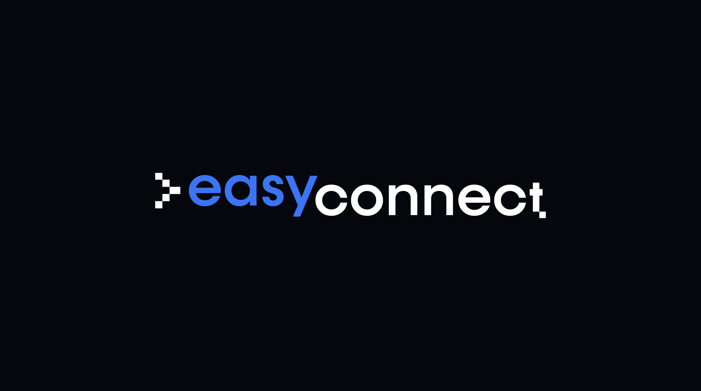

# EASY CONNECT – MKT & COMMS PLAN

### Value proposition

Position **Easy Connect as "the bridge between two worlds"**, the intricate blockchain ecosystem and the user-friendly automation tools businesses already rely on.

Core messaging will emphasize:

- **Democratization**: "Qubic for everyone, no coding required."
- **Simplicity**: "Transform weeks of development into minutes of configuration."
- **Trust**: "Deliver trustworthy Qubic data to business processes in real time."

### Audience targeting

We will focus on three different buyer persona:

- **Qubic ecosystem**: Existing applications and services who want to obtain data in real time for monitoring, reporting, user support...
- **No-code/low-code developers**: Current users of Make/Zapier looking to expand their automation capabilities including Qubic data.
- **Web3 startups and blockchain firms**: Requiring seamless integration with Qubic network.

### Content strategy

**Content pillars**

- **Educational resources**: Pushing Qubic’s relevance across industries.
- **Use cases**: Practical examples of Qubic-Make/Zapier integrations.
- **Tutorials**: Step-by-step guides and videos for implementing workflows.
- **Trend insights**: Analyses of Qubic and automation’s evolving landscape.

**Content formats**

- **Social networks**: Technical deep dives in X and Farcaster, business-centric articles in LinkedIn.
- **Blog and newsletter**: Product information, use cases and technical posts.
- **Video tutorials**: Walkthroughs of common integration scenarios.
- **Webinars**: Live demonstrations and Q&A sessions in X and LinkedIn.

### Social media strategy

Since MAD Hack 2025 we have started a social media positioning strategy, which will be increased during the development of the project to achieve community engagement and capture potential leads, as well as Easy Connect promoters.

We will focus on X mainly (starting also Qubic community in Farcaster) since it is where the communities interested in Blockchain and Web3 are currently located, to capture potential leads and generate engagement.

In parallel, we will use LinkedIn to reach companies and professionals interested in automation and the Blockchain applications they can integrate into their businesses.

**X and Farcaster**

- **Strategy**: Based on [@nevtrace](https://x.com/nevtrace) and [@joobid](https://x.com/joobid) positioning within the Blockchain and Web3 ecosystem in X and Farcaster (+6,000 followers in X, +3,000 in Farcaster):
  - **Educational threads**: Step-by-step use case explanations under #NoCodeBlockchain.
  - **Product updates**: Announcements of new features and integrations.
  - **Community engagement**: Retweets and interactions with Qubic/no-code communities.
  - **Polls**: Identifying pain points and preferences within the target audience.
- **Actions**:
  - Create [EasyConnect](https://x.com/_easyconnect) account and start building community around Qubic.
  - Maintain a content calendar with 2-3 day posts blending education, promotion, and dialogue.
  - Implement a rapid-response system to boost engagement with trending topics.

**LinkedIn**

Strategy Based on [Jorge Ordovas](https://www.linkedin.com/in/jorgeordovas/) positioning in LinkedIn as Blockchain expert (+10,000 followers).

- **Content Frequency**: 3 posts per week on LinkedIn:
  - Technical insights on blockchain and no-code integrations.
  - Qubic ecosystem updates and Easy Connect developments.
  - Broader reflections on Web3 and enterprise automation.

- **Group engagement strategy**: Active participation in 3 automation-focused groups:
  - No-Code Founders Community (15,000+ members).
  - Zapier Users & Automation (8,000+ members).
  - Make.com Community (12,000+ members).

**Engagement targets**

Objectives as a result of social media activity:
  - 15-20 new relevant connections monthly.
  - 5-8% engagement rate on posts.
  - 3-5 meaningful interactions per publication.

### Telegram and Discord Qubic groups

We will continue to actively participate in the Qubic ecosystem (in English and Spanish) on both Telegram and Discord, to achieve community engagement and capture potential leads, as well as promoters.

**Strategy**:

- **Product updates**: Announcements of roadmap and milestone achivements, new features and integrations.
- **Technical deep dives**: Advanced discussions tailored to Qubic-native audiences.
- **Exclusive AMAs**: Direct Q&A with the development and ecosystem Qubic teams.
- **Actions**:
  - Collaborations with 5 existing Qubic community leaders for increased engagement.
  - Offer early beta access to Telegram/Discord users.
  - Maintain daily presence in key Qubic communities (English and Spanish).

### Blog and newsletter

We will also publish featured content on the project website, providing details on how Easy Connect works and the use cases that can be developed with this solution.

The website will offer the opportunity to subscribe and receive updates on the development of Easy Connect through a periodic newsletter, being part of a early user group that will be able to test the first version of the product, as well as receive promotions.

- **Content topics**:
  - Educational content about Qubic blockchain capabilities.
  - Easy Connect use case demonstrations and tutorials.
  - Industry trend analysis and automation insights.
  - Community highlights and partnership announcements.

- **Blog publishing frequency and content schedule**:
  - Bi-Weekly featured articles (26 articles per year).
  - Monthly technical tutorials (12 tutorials per year).
  - Quarterly partnership announcements (4 announcements per year).
  - Quarterly state reports (4 reports per year).

- **Newsletter distribution**:
  - Primary newsletter: Bi-weekly distribution (26 editions per year).
  - Technical deep dive: Monthly for developers (12 editions per year).

### Events and public relations

We will participate in the following types of virtual/in-person events:
- **Blockchain and Web3 ecosystem meetings**: Active participation to engage with potential customers and investors (Monthly).
- **Workshops**: Hands-on sessions for specific Qubic use cases (Bi-Monthly).
- **Hackathons**: Competitions to build innovative integrations using Easy Connect (1 per year).
- **Conference participation**: Keynote speeches and exhibition booths at blockchain events (1 per year).

### Implementation timeline

The marketing and communications strategy is being developed in parallel with the execution of the Easy Connect project plan and will continue beyond the end of the incubation program.

This is the proposed plan for the first year, which will be developed progressively based on the available budget (crossed out activities are already completed):

- **~~Preparation (Months 1–2)~~**~~:~~
  - ~~Design branding, content assets, and implement analytics.~~
  - ~~Launch Kairos website including Easy Connect.~~
  - ~~Create Easy Connect accounts in X and Farcaster.~~
  - ~~Start positioning Easy Connect in X and building community around Qubic.~~
  - ~~Start publishing Qubic related content in LinkedIn.~~
  - ~~Start engaging with Qubic community in Telegram and Discord.~~
- **Soft launch (Month 3-4)**:
  - Continue positioning Easy Connect in X, LinkedIn, Telegram and Discord (demos, roadmap, etc)
  - Launch limited beta release and influencer pilot programs.
- **Full launch (Months 5–6)**:
  - Global ad campaigns.
  - PR blitz.
  - Virtual events.
- **Growth (Months 7–12)**:
  - Community expansion.
  - Success stories.
  - Feature updates.

### Annex: Posts generated and impact (as of 2/6/2025)

As an example, we have compiled some of the publications and articles we have made on social media, identifying their impact (as of 6/2/2025):

**NevTrace account in X**

[25/4 NevTrace wins 2nd prize at MAD Hack 2025](https://x.com/NevTrace/status/1915836888339910990): 991 impacts, 47 interactions

[4/5 Know Qubic & MAD Hack 2nd best](https://x.com/NevTrace/status/1919015502946386111): 15k impacts, 99 interactions

[7/5 Easy Connect is here](https://x.com/NevTrace/status/1920357018260422912): 968 impacts, 36 interactions

[12/5 NevTrace tests with Qubic web wallet and Ledger](https://x.com/NevTrace/status/1921951731128176779): 6.3k impacts, 187 interactions

[15/5 Easy Connect joins Qubic ecosystem (Spanish)](https://x.com/NevTrace/status/1923093199456702620): 1.6K impacts, 85 interactions 

[15/5 Easy Connect joins Qubic ecosystem (English)](https://x.com/NevTrace/status/1923073954060619946): 941 impacts, 50 interactions

[21/5 Easy Connect presentation at Superpioneros event](https://x.com/NevTrace/status/1925275926025445420): 773 impacts, 39 interactions.

**Jorge Ordovás account in LinkedIn**

[27/4 NevTrace wins 2nd prize at MAD Hack 2025](https://www.linkedin.com/posts/jorgeordovas_qubik-activity-7309678716069068800-7Y_j?utm_source=share&utm_medium=member_desktop&rcm=ACoAAAEd9NcBbgvRx4-d-xRwrMBjxtkMOwIuLOM): 3,4K impacts, 109 interactions

[4/5 Discover Qubic and Easy Connect article (Spanish)](https://www.linkedin.com/pulse/descubre-qubic-la-intersecci%C3%B3n-de-blockchain-e-ia-jorge-ordov%C3%A1s-efpzf/?trackingId=7PBRPbv8TcOSXrEes4DJYA%3D%3D): 2,3K impacts, 47 interactions

